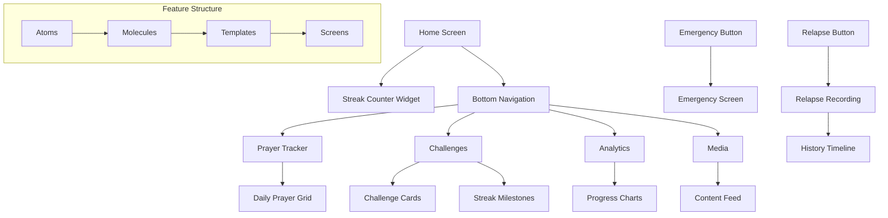

# DevLog: Escape App - Main Features UI Implementation

## 1. Conceptual Plan

### What We Want to Achieve
After successfully completing the onboarding experience, we're now building the core UI components that will form the heart of the Escape app. These features work together to create a comprehensive support system for users on their journey toward spiritual purity and overcoming temptations.

### The Seven Core Features
1. **Streak Counter** - A prominent, motivating display of consecutive clean days
2. **Prayer Tracker (Salah)** - Simple binary tracking of completed/missed prayers
3. **Challenges System** - Gamified achievement system with badges, cards, levels, and stars
4. **Emergency Section** - Crisis intervention tools with emergency contacts and helpful tips
5. **Relapse Recording** - Honest tracking system for setbacks with historical data
6. **Analytics Dashboard** - Visual graphs and insights into progress patterns
7. **Media Section** - Community-building content with blogs, articles, and videos

### Why This Matters
These features create a complete ecosystem of support, motivation, accountability, and community. The streak counter provides daily motivation, prayer tracking reinforces spiritual discipline, challenges gamify progress, emergency tools provide immediate help during temptation, relapse recording maintains honesty, analytics show patterns, and media builds community connection.

### UI Philosophy
We're maintaining our UI-First Architecture and Atomic Design approach, creating beautiful, intuitive interfaces that guide users naturally through their recovery journey without overwhelming them with complex interactions.

## 2. Codebase Review

### Current State Analysis
- ✅ **Onboarding Feature**: Complete UI implementation (Alhamdulillah!)
- **Project Structure**: Following atomic design methodology
- **Navigation**: Bottom navigation bar with home page as primary screen
- **Theme System**: Established design tokens and components
- **State Management**: TBD (UI-only focus for now)

### Key Integration Points
- **Home Page**: Primary container for streak counter and navigation to other features
- **Bottom Navigation**: Access points to main feature sections
- **Shared Components**: Reusable atoms and molecules across features

## 3. Technical Plan

### Feature Organization (7 Main Subtasks)

#### Subtask 1: Streak Counter UI
**Files to be created:**
- `lib/features/streak/atoms/streak_number.dart` - Large streak display number
- `lib/features/streak/atoms/streak_label.dart` - "Days Clean" text
- `lib/features/streak/atoms/streak_icon.dart` - Visual streak indicator
- `lib/features/streak/molecules/streak_card.dart` - Complete streak display component
- `lib/features/streak/screens/streak_detail_screen.dart` - Detailed streak view

#### Subtask 2: Prayer Tracker UI
**Files to be created:**
- `lib/features/prayer/atoms/prayer_checkbox.dart` - Individual prayer completion toggle
- `lib/features/prayer/atoms/prayer_time_label.dart` - Prayer name display (Fajr, Dhuhr, etc.)
- `lib/features/prayer/molecules/prayer_row.dart` - Single prayer tracking row
- `lib/features/prayer/molecules/daily_prayer_grid.dart` - All 5 prayers layout
- `lib/features/prayer/screens/prayer_tracker_screen.dart` - Full prayer tracking interface

#### Subtask 3: Challenges System UI
**Files to be created:**
- `lib/features/challenges/atoms/challenge_badge.dart` - Achievement badge component
- `lib/features/challenges/atoms/challenge_star.dart` - Star rating display
- `lib/features/challenges/atoms/progress_bar.dart` - Challenge progress indicator
- `lib/features/challenges/molecules/challenge_card.dart` - Individual challenge display
- `lib/features/challenges/molecules/streak_milestone_card.dart` - Streak-specific challenges
- `lib/features/challenges/templates/challenges_grid.dart` - Grid layout for challenges
- `lib/features/challenges/screens/challenges_screen.dart` - Main challenges interface

#### Subtask 4: Emergency Section UI
**Files to be created:**
- `lib/features/emergency/atoms/emergency_button.dart` - Quick action buttons
- `lib/features/emergency/atoms/tip_card.dart` - Individual helpful tip display
- `lib/features/emergency/molecules/contact_selector.dart` - Emergency contact interface
- `lib/features/emergency/molecules/tips_carousel.dart` - Scrollable tips display
- `lib/features/emergency/screens/emergency_screen.dart` - Crisis intervention interface

#### Subtask 5: Relapse Recording UI
**Files to be created:**
- `lib/features/relapse/atoms/relapse_button.dart` - "Record Relapse" button
- `lib/features/relapse/atoms/history_item.dart` - Individual relapse record display
- `lib/features/relapse/molecules/relapse_confirmation.dart` - Confirmation dialog
- `lib/features/relapse/molecules/history_timeline.dart` - Historical relapse view
- `lib/features/relapse/screens/relapse_history_screen.dart` - Complete history interface

#### Subtask 6: Analytics Dashboard UI
**Files to be created:**
- `lib/features/analytics/atoms/stat_card.dart` - Individual statistic display
- `lib/features/analytics/atoms/chart_container.dart` - Chart wrapper component
- `lib/features/analytics/molecules/progress_chart.dart` - Progress visualization
- `lib/features/analytics/molecules/streak_graph.dart` - Streak history graph
- `lib/features/analytics/templates/analytics_dashboard.dart` - Dashboard layout
- `lib/features/analytics/screens/analytics_screen.dart` - Complete analytics interface

#### Subtask 7: Media Section UI
**Files to be created:**
- `lib/features/media/atoms/article_thumbnail.dart` - Article preview image
- `lib/features/media/atoms/media_title.dart` - Content title display
- `lib/features/media/atoms/media_tag.dart` - Content category tags
- `lib/features/media/molecules/article_card.dart` - Article preview card
- `lib/features/media/molecules/video_card.dart` - Video preview card
- `lib/features/media/templates/media_feed.dart` - Scrollable content feed
- `lib/features/media/screens/media_screen.dart` - Main media interface

### Core Navigation & Layout Files
**Files to be modified:**
- `lib/screens/home_screen.dart` - Add streak counter component
- `lib/widgets/bottom_navigation.dart` - Add navigation to all feature screens
- `lib/routes/app_routes.dart` - Add routes for all new screens

### Architecture Diagram

### Implementation Approach

1. **Phase 1**: Build shared atoms and establish design patterns
2. **Phase 2**: Implement each feature subtask independently
3. **Phase 3**: Integrate features into home screen and navigation
4. **Phase 4**: Create seamless transitions between features
5. **Phase 5**: Polish and refine all UI components

## 4. To-Do List

### Phase 1: Foundation & Shared Components
- ⏳ Set up feature folder structures for all 7 subtasks
- ⏳ Create shared design tokens and theme extensions
- ⏳ Build common atoms (buttons, cards, icons)
- ⏳ Update home screen layout structure

### Subtask 1: Streak Counter UI
- ⏳ Build StreakNumber atom with large, prominent display
- ⏳ Build StreakLabel atom with motivational text
- ⏳ Build StreakIcon atom with visual indicator
- ⏳ Compose StreakCard molecule for home screen
- ⏳ Create detailed StreakDetailScreen
- ⏳ Integrate streak counter into home screen

### Subtask 2: Prayer Tracker UI
- ⏳ Build PrayerCheckbox atom for binary tracking
- ⏳ Build PrayerTimeLabel atom for prayer names
- ⏳ Compose PrayerRow molecule for individual prayers
- ⏳ Build DailyPrayerGrid molecule for all 5 prayers
- ⏳ Create PrayerTrackerScreen interface
- ⏳ Add prayer tracker to bottom navigation

### Subtask 3: Challenges System UI
- ⏳ Build ChallengeBadge atom with achievement visuals
- ⏳ Build ChallengeStar atom for rating display
- ⏳ Build ProgressBar atom for challenge progress
- ⏳ Compose ChallengeCard molecule
- ⏳ Build StreakMilestoneCard for streak challenges
- ⏳ Create ChallengesGrid template layout
- ⏳ Build complete ChallengesScreen
- ⏳ Add challenges to bottom navigation

### Subtask 4: Emergency Section UI
- ⏳ Build EmergencyButton atom for quick actions
- ⏳ Build TipCard atom for helpful suggestions
- ⏳ Compose ContactSelector molecule
- ⏳ Build TipsCarousel molecule with scrollable tips
- ⏳ Create EmergencyScreen crisis interface
- ⏳ Add emergency access from home screen

### Subtask 5: Relapse Recording UI
- ⏳ Build RelapseButton atom with confirmation flow
- ⏳ Build HistoryItem atom for individual records
- ⏳ Compose RelapseConfirmation molecule
- ⏳ Build HistoryTimeline molecule
- ⏳ Create RelapseHistoryScreen
- ⏳ Integrate relapse recording with streak counter

### Subtask 6: Analytics Dashboard UI
- ⏳ Build StatCard atom for individual statistics
- ⏳ Build ChartContainer atom for graph displays
- ⏳ Compose ProgressChart molecule
- ⏳ Build StreakGraph molecule for history visualization
- ⏳ Create AnalyticsDashboard template
- ⏳ Build complete AnalyticsScreen
- ⏳ Add analytics to bottom navigation

### Subtask 7: Media Section UI
- ⏳ Build ArticleThumbnail atom for content previews
- ⏳ Build MediaTitle atom for content titles
- ⏳ Build MediaTag atom for categorization
- ⏳ Compose ArticleCard molecule
- ⏳ Compose VideoCard molecule
- ⏳ Create MediaFeed template for scrollable content
- ⏳ Build complete MediaScreen
- ⏳ Add media section to bottom navigation

### Phase 2: Integration & Polish
- ⏳ Test all feature navigation flows
- ⏳ Ensure consistent design language across features
- ⏳ Add smooth transitions and animations
- ⏳ Optimize performance and responsiveness
- ⏳ Create comprehensive UI component documentation

## 5. Progress Notes

### 2024-07-24 - Main Features Planning
- **Achievement**: ✅ Onboarding UI completed successfully (Alhamdulillah!)
- **Scope Defined**: Seven core feature subtasks identified and planned
- **Architecture Decision**: Maintaining UI-First approach with atomic design
- **Focus Confirmed**: Pure UI implementation without state management logic
- **Organization**: Each feature as independent subtask for parallel development
- **Next Step**: Begin Phase 1 foundation work and shared component creation

---

*Bismillah - May Allah grant us success in creating these tools that will help our brothers and sisters stay on the straight path and find strength in their moments of weakness. Ameen.*