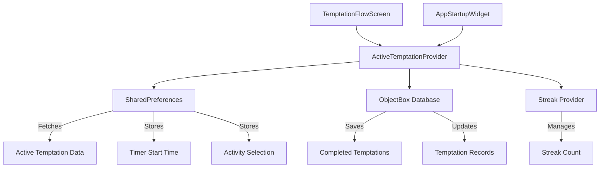

# Temptation Management System Refactoring Plan

## Current State Analysis

The current implementation has:
- Multiple temptation providers (`ActiveTemptations`, `AllTemptations`, `TodaysTemptations`, etc.)
- Direct service usage in the temptation flow screen
- Timer tracking that's not persisted in shared preferences
- Streak management in a separate provider

## Required Changes

I need to create a single `ActiveTemptationProvider` that:
1. Fetches from shared preferences on initialization
2. Manages temptation state and persistence
3. Handles streak upsert operations
4. Saves completed temptations to ObjectBox
5. Tracks timer in shared preferences
6. Provides methods for cancellation and completion

## Architecture Overview

## Key Components

### 1. ActiveTemptationProvider
- **State**: `AsyncValue<Temptation?>` - null or active temptation
- **Initialization**: Check SharedPreferences for active temptation
- **Methods**:
  - `startTemptation()` - Create new temptation and store in SharedPreferences
  - `completeTemptation()` - Save to ObjectBox, update streak, clear SharedPreferences
  - `cancelTemptation()` - Clear SharedPreferences without saving
  - `upsertStreak()` - Handle streak updates (success/relapse)
  - `updateTimer()` - Track timer progress in SharedPreferences

### 2. Updated TemptationFlowScreen
- Use `ActiveTemptationProvider` instead of direct service calls
- Leverage Riverpod's `when` syntax for state handling
- Remove direct dependency on `TemptationStorageService`

### 3. Enhanced SharedPreferences Integration
- Store timer start time and calculate elapsed time on app restart
- Persist activity selection and other temptation metadata
- Handle app lifecycle interruptions gracefully

## Implementation Steps

### Phase 1: Create ActiveTemptationProvider
- Single source of truth for temptation state
- Fetch from SharedPreferences on initialization
- Handle both new and existing temptations
- Provide clean API for UI components

### Phase 2: Refactor TemptationFlowScreen
- Replace direct service calls with provider methods
- Use Riverpod's reactive state management
- Simplify state management in the screen

### Phase 3: Enhance Timer Tracking
- Add timer start time to SharedPreferences
- Calculate elapsed time on app restart
- Handle timer state across app sessions

### Phase 4: Streak Integration
- Connect streak provider to temptation completion
- Handle relapse scenarios properly
- Ensure streak data consistency

### Phase 5: Cleanup and Testing
- Remove old providers and services
- Test complete flow from start to finish
- Ensure proper error handling

## Benefits of This Approach

1. **Single Responsibility**: One provider handles all temptation-related state
2. **Persistence**: SharedPreferences ensures state survives app restarts
3. **Timer Tracking**: Proper timer state management across sessions
4. **Streak Integration**: Seamless connection between temptations and streaks
5. **Clean Architecture**: Clear separation of concerns and dependencies

## Todo List

- [ ] Create new ActiveTemptationProvider with single responsibility
- [ ] Refactor temptation flow screen to use new provider
- [ ] Add timer tracking to shared preferences
- [ ] Implement streak upsert methods in provider
- [ ] Update app startup to initialize temptation provider
- [ ] Test the complete flow and ensure proper state management
- [ ] Remove old temptation providers (cleanup)

This plan addresses all your requirements:
- ✅ Single provider (`ActiveTemptationProvider`)
- ✅ Fetches from shared preferences
- ✅ Methods for upserting streak and saving to ObjectBox
- ✅ Timer tracking in shared preferences
- ✅ Proper state management and business logic